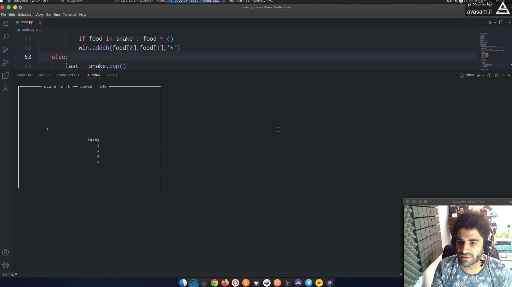

---

# اسکریپت بازی مار با زبان پایتون
این اسکریپت با زبان برنامه نویسی پایتون نوشته شده است و یک بازی مشابه بازی مار یا snake با زبان برنامه نویسی پایتون میباشد
از هیچ ابزار گرافیکی استفاده نشده و گیم در محیط ترمینال اجرا میشود 

[ لینک آموزش ساخت بازی مار با پایتون ](https://avasam.ir/post/381/create-snake-game-with-python)

## آموزش ساخت بازی مار با پایتون 
این ریپازیتوری در واقع برای یک ویدیوی آموزشی و یک مقاله ی آموزشی میباشد که در آن آموزش یاد میدهیم که چطور با زبان پایتون یک بازی مار درست کنید 

### امکانات بازی مار
در این بازی از امکانات ساده استفاده شده و هدف آموزشی بوده است
> مار از نقطه ای استارت میزند و شروع به حرکت میکند با کیبورد و دکمه های بالا پایین چپ راست هدایت میشود و بصورت رندم یک غذا در صفحه نمایان میشود
هر بار که مار غذا را میخورد یک واحد به طول آن اضافه میشود و طبق الگوریتم نوشته شده از سرعت بازی کم میشود 
امتیازات در این بازی محاسبه و بالای صفحه نوشته میشود
در صورت برخورد مار با خودش یا حاشیه ی زمین بازی ، بازی متوقف میشود
